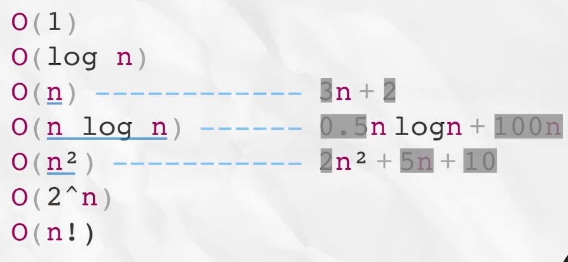

# 📌 TIL - 2026.02.25
> Topic: Big-O

---

# 1️⃣ 학습 목적 및 배경 (Why)

- 학습 계기: 효율적인 코드 작성 고려를 위한 **Big-O 표기법** 이론 학습
- 해당 개념이 등장하는 영역:
    - [ ] 자료구조
    - [ ] 알고리즘
    - [ ] 코딩 테스트
    - [x] CS 이론
- 해결하려는 문제 유형:
- 실무 확장 가능성: 

---

# 2️⃣ 핵심 개념 정리 (What)

## 2.1 정의
- 시간 복잡도, 공간 복잡도 : 알고리즘 성능을 측정하는 척도
- 시간 복잡도 (Time Complexity)
    - 어떤 알고리즘이 다루는 데이터의 개수에 비해 얼마만큼의 '시간'을 사용하는가?
    - "몇 번의 연산을 거쳐야 하는가?" => 시간이 아닌 **횟수**의 문제
- 공간 복잡도 (Space Complexity)
    - 데이터에 비해 얼마만큼의 '메모리 공간'을 사용하는가?

## 2.2 등장 배경
- 왜 이 개념이 필요했는가?
  - Big-O 표기법 : 시간 복잡도와 공간 복잡도를 나타내기 위함.
- 기존 방식의 한계는?

## 2.3 핵심 원리
- Big-O 표기법
  - 시간 복잡도와 공간 복잡도를 나타내기 위함.
  - '이 알고리즘은 데이터를 많이 넣을수록 얼마나 느려질까?'를 수학적으로 나타낸 것.
  - 

## 2.4 시간 복잡도

| 연산 | 시간 복잡도 | 근거 |
|------|--------------|------|
| 삽입 |              |      |
| 삭제 |              |      |
| 탐색 |              |      |

### ✔ Big-O 분석 논리
- 반복 구조:
- 재귀 깊이:
- 자료구조 내부 동작 원리:

## 2.5 공간 복잡도
- 기본 저장 공간:
- 추가 메모리 사용:
- 재귀 스택 사용 여부:

---