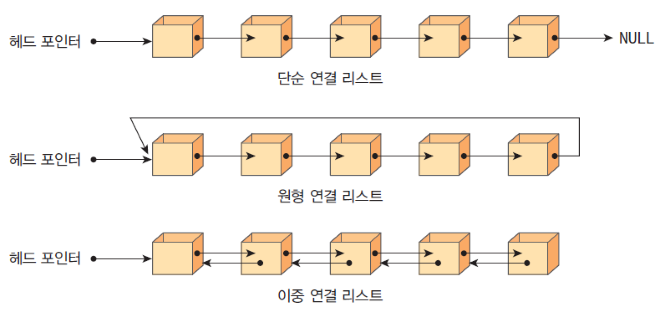
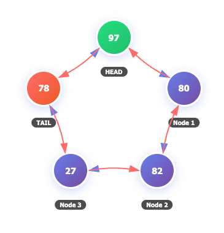

# 📌 TIL (Today I Learned)

## 📅 Date

-   2026.03.04
-   Study Time:
-   Category: 자료구조

------------------------------------------------------------------------

# 1️⃣ 오늘의 학습 목표

- 배열과 리스트
  - 단일 연결 리스트, 이중 연결 리스트, 원형 연결 리스트
  

------------------------------------------------------------------------

# 2️⃣ 핵심 개념 정리 (What)

## 🔹 개념 1
단일 연결리스트

### 정의
- INSERT: 시간복잡도 Head(O(1)), Tail(O(n)), Position(O(n)) 
  - 리스트가 얼마나 길든, 처음에 위치한 Head에는 바로 접근 가능
  - 맨 끝, 주어진 위치 => 해당 위치까지 각 요소들을 거쳐 이동해야하므로 최대로는 배열의 길이만큼 연산 필요 
- DELETE: Head(O(1)), Tail(O(n)), Value(O(n)), Index(O(n))
- SEARCH, TRAVERSE: O(n)
  - Traverse : 말 그대로 리스트 전체를 순회하며 각 요소에 주어진 일을 수행

## \### 핵심 포인트
- 배열의 요소 추가, 시간 복잡도는 똑같이 'n'이나, 어지간해서는 연결리스트가 더 빠름.

## \### 왜 중요한가?
- Head 바로 접근

### 기본 구현
- 단일 연결 리스트(Linked Lists)
``` java
// 코드 예시
class Node {
    int data;
    Node next;
    Node(int data) {
        this.data = data;
        this.next = null;
    }
}

public class SinglyLinkedList {
    Node head; // 첫 요소

    // 헤드에 요소를 추가하는 것 => 리스트의 길이와 상관없으므로 시간 복잡도가 O(1)
    public void insertAtHead(int data) {
        Node newNode = new Node(data);
        newNode.next = head;
        head = newNode; // 관리자가 가진 연락처는 새로 만들어진 노드의 전화번호로 바꿔줌
    }

    public void insertAtPosition(int data, int position) { // data: 데이터, position: 위치 
        if (position == 0) {
            insertAtHead(data);
            return;
        }
        Node newNode = new Node(data);
        Node current = head; // 다음 사람으로 넘어갈 때마다 current가 바뀜
        // position의 크기는 거쳐갈 노드의 수와 정비례
        for (int i = 0; i < position - 1 && current != null; i++) {
            current = current.next;
        }
        // 루프를 돌는 중에, 또는 다 돌고 나서 current의 값이 무효하다면 잘못된 위치값이 주어진 것임.
        if (current == null) return; // 유효X => 종료
        // 위치가 유효 => 새 값을 리스트에 끼워넣음
        newNode.next = current.next;
        current.next = newNode; 
        // 새 요소가 다음 요소를 가리키고 이전 요소가 새 요소를 가리킴
    }

    public void delete(int key) {
        Node current = head, prev = null;
        while (current != null) {
            if (current.data == key) {
                if (prev != null) {
                    prev.next = current.next;
                } else {
                    head = current.next;
                }
                return;
            }
            prev = current;
            current = current.next;
        }
    }

    public boolean search(int key) {
        Node current = head;
        while (current != null) {
            if (current.data == key) return true;
            current = current.next;
        }
        return false;
    }

    // 리스트의 모든 요소들을 순회하며 특정 작업을 수행
    public void traverse() {
        Node current = head;
        while (current != null) {
            System.out.print(current.data + " -> ");
            current = current.next;
        }
        System.out.println("null"); // 마지막 요소는 가리키는 값이 없으므로 루프를 다 돌고 나면 next가 비었음을 출력하고 마무리
    }

    public static void main(String[] args) {
        
        SinglyLinkedList ll = new SinglyLinkedList();
        
        ll.insertAtHead(17);
        ll.insertAtHead(18);
        ll.insertAtHead(19);
        ll.insertAtHead(76);
        ll.insertAtHead(44);
        
        ll.insertAtPosition(34, 3);
        
        ll.delete(18);
        
        System.out.println(ll.search(19)); // true
        
        ll.traverse();
        // 44 -> 76 -> 19 -> 34 -> 17 -> null
    }
}
```

------------------------------------------------------------------------

## 🔹 개념 2
- 이중 연결리스트
- 이중 원형 연결리스트

### 정의
- INSERT: 시간복잡도 Head(O(1)), Tail(O(1)), Position(O(n))
    - Head, Tail => 요소를 맨 앞에 넣을 수도, 맨 뒤에 넣을 수도 있다는 의미 (맨 끝에서부터도 작업 가능!)
- DELETE: Head(O(1)), Tail(O(1)), Value(O(n)), Index(O(n))
- SEARCH(탐색): Head(O(n)), Tail(O(n))
- TRAVERSE(순회): O(n)

## \### 핵심 포인트
- 이중 연결리스트: 이전 요소와 다음 요소가 서로의 참조값을 가짐.
  - 즉, 각 요소는 이전 요소와 다음 요소를 모두 가리키고 있음
  - 따라서 정방향 뿐만 아니라 역방향으로도 작업이 가능 (첫 요소 뿐 아니라, 마지막 요소로부터도 순회 가능)
- 이중 원형 연결리스트: 마지막 요소의 '다음'은 첫 요소를 기리키고 이중 원형 연결리스일 경우 첫 요소의 '이전'은 마지막 요소를 가리킴

## \### 왜 중요한가?
- 단일 연결리스트처럼 Head에 바로 접근이 되지만 이는 이중 연결리스트이므로 Tail도 가능하다는 점.
- 이중 연결 리스트는 앞으로 Stack, Queue 등의 자료구조에서 유용하게 사용됨.

### 기본 구현
- 이중 연결 리스트(Linked Lists) 
``` java
// 코드 예시
class Node {
    int data;
    Node prev, next; // 비상연락망) 다음 사람 뿐만 아니라 이전 사람의 전화번호도 갖고 있어야
    Node(int data) {
        this.data = data;
    }
}

public class DoublyLinkedList {
    Node head, tail; // head와 tail => 즉, 역방향도 가능

    public void insertAtHead(int data) {
        Node newNode = new Node(data);
        if (head == null) {
            head = tail = newNode;
        } else {
            // 앞 요소와 뒷 요소가 쌍방으로 서로의 전화번호를 가짐.
            newNode.next = head;
            head.prev = newNode;
            head = newNode;
        }
    }

    // 이중 연결 리스트에서 추가!
    public void insertAtTail(int data) {
        Node newNode = new Node(data);
        if (tail == null) {
            head = tail = newNode;
        } else {
            tail.next = newNode;
            newNode.prev = tail;
            tail = newNode;
        }
    }

    public void deleteFromHead() {
        if (head == null) return;
        if (head == tail) {
            head = tail = null;
        } else {
            head = head.next;
            head.prev = null;
        }
    }

    public void deleteFromTail() {
        if (tail == null) return;
        if (head == tail) {
            head = tail = null;
        } else {
            tail = tail.prev;
            tail.next = null;
        }
    }

    // 탐색
    public boolean searchFromHead(int key) {
        Node current = head;
        // 원하는 데이터를 찾을 떄까지 리스트 전체를 순회
        while (current != null) {
            if (current.data == key) return true;
            current = current.next; // 차이1
        }
        return false;
    }

    public boolean searchFromTail(int key) {
        Node current = tail;
        while (current != null) {
            if (current.data == key) return true;
            current = current.prev; // 차이2
        }
        return false;
    }

    public void traverseForward() {
        Node current = head;
        while (current != null) {
            System.out.print(current.data + " -> ");
            current = current.next;
        }
        System.out.println("null");
    }

    public void traverseBackward() {
        Node current = tail;
        while (current != null) {
            System.out.print(current.data + " <- ");
            current = current.prev;
        }
        System.out.println("null");
    }

    public static void main(String[] args) {
    
        DoublyLinkedList dll = new DoublyLinkedList();
        
        dll.insertAtHead(14);
        dll.insertAtHead(36);
        dll.insertAtHead(62);
        dll.insertAtHead(77);
        dll.insertAtHead(22);
        
        dll.insertAtTail(48);
        
        dll.deleteFromTail();
        
        System.out.println(dll.searchFromHead(36));
        // true

        dll.traverseForward();
        // 22 -> 77 -> 61 -> 36 -> 14 -> None
        
        dll.traverseBackward();
        // 14 <- 36 <- 61 <- 77 <- 22 <- None
    }
}
```
------------------------------------------------------------------------

## 🔹 개념 3
- 원형 연결리스트


### 정의
- INSERT: 시간복잡도 Head(O(1)), Tail(O(1)), Index(O(n))
    - Head와 Tail이 이어져있음을 제외하면 이중 연결리스트와 동일
- DELETE: Head(O(1)), Tail(O(1)), Index(O(n))
- SEARCH, TRAVERSE: O(n)
- NAVIGATE: from Head(O(n)), from Tail(O(n))

## \### 핵심 포인트
- 마지막 요소가 다음 요소로 첫번째 요소를 가리켜서 요소들이 마치 원형으로 연결된 것처럼 끊임없이 다음 요소로 넘어갈 수 있는 형태
- Tail은 다음 요소로 Head를, Head는 이전 요소로 Tail을 가리킴.
- 원형 연결 리스트의 특성을 가장 잘 보여주는 작업 => Navigate

## \### 왜 중요한가?
- 리스트의 길이보다 많은 횟수를 한쪽 방향으로 순회할 수 있음. => 원형 연결 리스트이므로 가능한 기능
- 순환이 가능한 구조는 반복적인 선택이나 순회가 필요한 다양한 프로그램에 유용하게 쓰임
  - ex. 게임 무기 선택

### 기본 구현
- 단일 연결 리스트(Linked Lists)
``` java
// 코드 예시
class Node {
    int data;
    Node prev, next;
    Node(int data) {
        this.data = data;
    }
}

public class DoublyCircularLinkedList {
    Node head; // 첫 번째 요소
    /**
     * Tail이 없는 이유? 
     * 원형 연결 리스트에는 Head가 Tail의 연락처도 가지고 있기 떄문. 
     * 관리자가 첫 사람을 통해 마지막 사람과 바로 연락할 수 있으므로 마지막 사람의 연락처 필요 X
     */
    Node current; // 리스트를 앞뒤로 하나씩 순회할 떄 현재 선택된 요소를 가리키기 위한 속성

    public void insertAtHead(int data) {
        Node newNode = new Node(data);
        if (head == null) {
            head = newNode;
            head.next = head.prev = head;
            current = head;
        } else {
            Node tail = head.prev;
            newNode.next = head;
            newNode.prev = tail;
            head.prev = tail.next = newNode;
            head = newNode;
        }
    }

    public void insertAtTail(int data) {
        Node newNode = new Node(data);
        if (head == null) {
            head = newNode;
            head.next = head.prev = head;
            current = head;
        } else {
            Node tail = head.prev;
            newNode.prev = tail;
            newNode.next = head;
            tail.next = head.prev = newNode;
        }
    }


    public void deleteFromHead() {
        if (head == null) return;
        if (head.next == head) {
            head = current = null;
            return;
        }
        Node tail = head.prev;
        if (current == head) current = head.next;
        head = head.next;
        head.prev = tail;
        tail.next = head;
    }

    public void deleteFromTail() {
        if (head == null) return;
        if (head.next == head) {
            head = current = null;
            return;
        }
        Node tail = head.prev;
        if (current == tail) current = head;
        Node newTail = tail.prev;
        newTail.next = head;
        head.prev = newTail;
    }

    // 새롭게 추가 (원형 연결 리스트의 특수성을 보여주기 위함)
    // 한 요소씩 앞으로 이동
    public void moveNext() {
        if (current != null)
            current = current.next;
    }

    // 이중 연결 리스트이므로 뒤로 이동하는 메소드
    public void movePrev() {
        if (current != null)
            current = current.prev;
    }

    public void printCurrent() {
        if (current != null)
            System.out.println("Current: " + current.data);
        else
            System.out.println("Current: null");
    }

    public void traverseForward() {
        if (head == null) {
            System.out.println("Empty");
            return;
        }
        Node temp = head;
        do {
            System.out.print(temp.data + " -> ");
            temp = temp.next;
        } while (temp != head);
        System.out.println("(head)");
    }

    public void traverseBackward() {
        if (head == null) {
            System.out.println("Empty");
            return;
        }
        Node temp = head.prev;
        do {
            System.out.print(temp.data + " <- ");
            temp = temp.prev;
        } while (temp != head.prev);
        System.out.println("(tail)");
    }

    public static void main(String[] args) {
        DoublyCircularLinkedList dll
        = new DoublyCircularLinkedList();
        
        dll.insertAtTail(34);
        dll.insertAtTail(59);
        dll.insertAtTail(21);
        dll.insertAtTail(53);
        dll.insertAtTail(42);
        
        dll.insertAtHead(64);
        dll.deleteFromTail();
        
        dll.traverseForward();
        // 64 -> 34 -> 59 -> 21 -> 53 -> (head)

        dll.current = dll.head;
        dll.printCurrent(); // 64
        
        
        for (int i = 0; i < 8; i++) {
            dll.movePrev();
        }
        dll.printCurrent(); // 59
    }
}

```

------------------------------------------------------------------------

# 3️⃣ 내부 동작 원리 (How)

### 구조 설명

    (구조 또는 흐름도 작성)

### 동작 과정 단계별 정리

1.
2.
3.

------------------------------------------------------------------------

# 4️⃣ 시간복잡도 / 공간복잡도

연산   시간복잡도   공간복잡도
  ------ ------------ ------------


## \### 복잡도 분석 근거

-
-

------------------------------------------------------------------------

# 5️⃣ 코드 구현

## 🔹 기본 구현

``` java
// 코드 작성
```

## 🔹 개선/최적화 버전

``` java
// 최적화 코드
```

## \### 개선 포인트

-
-

------------------------------------------------------------------------

# 6️⃣ 실무 관점 연결 (Application)

-   실무에서 어디에 쓰이는가?
-   대용량 데이터 처리 시 고려사항
-   성능 문제 발생 가능 지점
-   트랜잭션/동시성 영향 여부

------------------------------------------------------------------------

# 7️⃣ 비교 분석 (Comparison)

항목        A   B
  ----------- --- ---
구조            
성능            
사용 사례

------------------------------------------------------------------------

# 8️⃣ 문제 상황 & 해결 과정 (Troubleshooting)

## \### 발생 문제

## \### 원인 분석

## \### 해결 방법

## \### 배운 점

------------------------------------------------------------------------

# 9️⃣ 오늘의 깨달음 (Insight)

-
-
-

------------------------------------------------------------------------

# 🔟 추가 학습 필요 항목 (Next Study)

-
-
-

------------------------------------------------------------------------

# 📚 참고 자료

-   공식 문서:
-   블로그:
-   강의:
-   기타:

------------------------------------------------------------------------

# 🧠 회고 (Reflection)

## \### 잘한 점

## \### 부족한 점

## \### 개선 방향

------------------------------------------------------------------------

# 🔄 복습 체크 (Review)

-   [ ] 1일 후 복습
-   [ ] 1주일 후 복습
-   [ ] 1개월 후 복습
