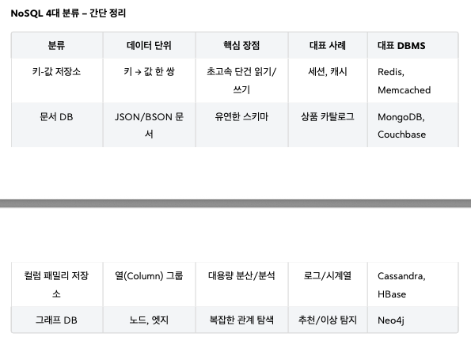

# TIL — {{2026-03-05}}

## 📌 Today Summary
- 오늘 배운 것 한 줄 요약
- 핵심 키워드: "RDBMS(관계형 데이터베이스 관리 시스템)"
  - 데이터베이스
    - 데이터 무결성 제약조건 : 데이터에는 일정한 규칙과 형식이 있어야 한다. (=데이터가 문제가 없다.)
      - 데이터의 정확성과 일관성을 유지하는 것이 중요.
    - 동시성 제어(Concurrency Control)
      - 여러 사용자가 동시에 안전하게 데이터에 접근하여 수정하려고 할 때 일관성이 꺠짐

---

## 🎯 Today’s Focus
- 오늘의 학습 주제: 데이터베이스 관리 시스템(DBMS, Database Management System)
- 왜 이걸 공부했는가: 테이블 설계 기초
- 기대했던 것:

---

## 📘 What I Learned
### 핵심 개념
- 데이터 구조나 제약조건을 통해 데이터가 깨지지 않도록 보장하는 것이 데이터 무결성
- DBMS의 역할과 기능
    - 1. 데이터 정의 기능 (Data Definition Language - DDL)
    - 2. 데이터 조작 기능 (Data Manipulation Language - DML)
    - 3. 보안, 동시성 제어, **트랜잭션 관리 기능**
        - **역할:** DBMS는 데이터의 보안을 유지하고, 여러 사용자가 동시에 데이터에 접근할 때 발생할 수 있는 문제
          를 제어하는 기능을 수행한다.
        - **보안(Security):** 허가된 사용자만이 데이터에 접근할 수 있도록 하고, 사용자별로 접근 가능한 데이
          터의 범위나 수행할 수 있는 작업(읽기, 쓰기, 수정 등)을 제한할 수 있다.
        - **동시성 제어(Concurrency Control):** 여러 사용자가 동시에 같은 데이터를 수정하려고 할 때, 데이
          터의 일관성이 깨지지 않도록 순서를 제어하거나 잠금(Locking) 메커니즘을 사용한다. (예: 쇼핑몰에
          서 동시에 여러 고객이 마지막 남은 한 개의 상품을 주문하려고 할 때, 한 고객에게만 판매가 완료되도
          록 처리)
        - **트랜잭션 관리(Transaction Management):** 아주 중요한 개념인데, 여러 개의 작업을 하나의 논리적인 단위(트랜잭션)로 묶어서 처리한다. 이 트랜잭션은 전부 성공적으로 완료되거나(Commit), 하나라도 실패하면 전부 이전 상태로 되돌아가야(Rollback) 데이터의 일관성이 보장된다 (이를 **원자성(Atomicity)** 이라고 한다).
            - ex. 계좌 이체라는 것은 (1) 나의 돈을 출금하고, (2) 대상 계좌에 돈을 입금하는 과정이다. 만약 나의 돈을 출금했는데, 대상 계좌에 돈을 입금하는 과정에서 문제가 발생하게 되면, 나의 돈만 사라지는 심각한 문제가 발생한다. 따라서 이 두 작업은 모두 성공하거나 모두 실패해야 한다.   
              만약 대상 계좌에 돈을 입금하는 과정에서 문제가 발생하면 나의 돈을 출금했던 것도 취소되어야 한다.   
              DBMS는 이러한 트랜잭션 관리를 통해 데이터의 일관성과 안정성을 보장한다.
    - 4. 데이터 중복 최소화 및 일관성 유지
        - **역할:** DBMS는 정규화(Normalization)라는 과정을 통해 데이터를 여러 테이블로 분리하여 저장함으로써 불필요한 데이터 중복을 줄인다.   
          데이터 중복이 줄어들면, 데이터를 수정할 때 여러 곳을 고칠 필요가 없어져 데이터 불일치 가능성이 현저히 낮아지고 저장 공간도 효율적으로 사용할 수 있다.
    - 5. 데이터 백업 및 복구 (Data Backup and Recovery)
- **관계형 데이터베이스 핵심 개념**
  - **테이블(Table)**: 데이터를 저장하는 표 형태의 기본 구조로, 행과 열로 구성된다.
  - **행(Row/Record)**: 테이블의 각 가로줄로, 개별 데이터 항목 하나를 나타낸다.
  - **열(Column/Field)**: 테이블의 각 세로줄로, 데이터의 종류(속성)를 정의한다.
  - **기본 키 (Primary Key, PK)**: 테이블의 모든 행을 유일하게 식별하는 값. **고유성**과 **NOT NULL** 규칙을 반드시 지켜야 한다.    
  데이터의 식별을 위해 모든 테이블에 PK를 설정하는 것이 원칙이다.    
  - **외래 키 (Foreign Key, FK)**: 한 테이블의 열이 다른 테이블의 기본 키를 참조하는 것.   
  테이블 간의 관계를 맺어주며 데이터 중복을 방지하고 **참조 무결성**을 보장한다.   
  이를 통해 논리적으로 분리된 데이터를 연결하여 관리할 수 있다.  

### 중요한 포인트
- 무결성
    - 데이터가 정확하고 일관되게 유지되는 상태
    - 저장·전송·처리 과정에서 변조, 손상, 누락이 없는 것
- 트랜잭션 관리
- 동시성 제어
- 테이블은 행(Row, 레코드라고도 함)과 열(Column, 필드 또는 속성이라고도 함)로 구성
- PK(기본키, Primary Key), 식별자
  - 반드시 지켜야할 중요 규칙: 고유성(Uniqueness), NOT NULL
- FK(외래 키, Foreign Key) - 따로 떨어진 표들을 '관계'로 묶는 방법
  - **외래 키란, 한 테이블(A)의 열(Column)이 다른 테이블(B)의 기본 키(Primary Key) 값을 참조하는 것**
  - **부모와 자식의 관계**
    두 테이블이 FK 값을 통해 관계가 있을 때 한쪽을 부모, 한쪽을 자식이라 한다. (자식 -> 부모를 찾아간다!)
    자식 테이블은 FK 값을 통해 부모 테이블을 참조한다. FK 값을 가진 곳이 자식 테이블이다.  
    여기서는 `orders` 테이블이 FK 값인 `customer_id` 를 통해 `customers` 테이블을 참조한다.  
    따라서 둘의 관계에서 `orders` 가 자식 테이블이고, `customers` 가 부모 테이블이 된다.
  - **외래 키의 중요한 규칙**
    - **참조 무결성(Referential Integrity)**: 외래 키 열에 있는 값은, 반드시 부모 테이블(참조 당하는 쪽, 여기서는 `customers` )의 기본 키 값 중 하나이거나, 혹은 비어있어야(NULL) 한다.   
    예를 들어, `orders` 테이블의 `customer_id` 에 `customers` 테이블에 존재하지도 않는 `99` 같은 값을 넣으려고 하면   
    데이터베이스가 "그런 고객은 존재하지 않습니다!"라며 오류를 발생시켜 막아준다. 이 덕분에 데이터의 정합성이 보장되는 것이다.  
    - **왜 외래 키를 사용해 테이블을 연결하는가?**    
    데이터의 중복을 막고, 데이터의 일관성을 유지하며, 논리적으로 분리된 데이터들 사이에 '관계'를 맺어주기 위해서다.   
    이를 통해 우리는 작고 관리하기 쉬운 여러 개의 테이블로 전체 시스템을 구조화할 수 있다.
    => 잘 구조화한다. 이는 즉, "데이터베이스 설계"이다.

### 인상 깊은 문장 / 내용
> 無(없을 무) + 缺(빠질 결) + 性(성질 성)
> 결함이나 빠짐이 없는 성질 → 완전하고 정확한 상태
 
> 결론적으로, DBMS는 개발자가 파일 시스템의 복잡한 부분을 직접 다루지 않도록 하고, 
> 대신 **데이터를 보다 체계적이고 안전하며 효율적으로 관리할 수 있는 추상화된 방법을 제공**하는 것이다. 그리고 그 과정에서 DBMS는 내부적으로 파일을 사용해서 실제 데이터를 디스크에 저장한다.
 
> 관계형 모델의 핵심 개념: 모든 데이터는 '표'에서 시작한다.
> 행(Row) = 레코드 Record = 튜플 Tuple
> 열(Column) = 속성 Attribute = 필드 Field
---

## 🧠 Insight
- 새롭게 이해한 점
  - NoSQL 4대 분류
    
  - 관계형 데이터베이스는 대부분의 실제 시나리오에서 널리 사용되며, ACID 속성을 통해 강력한 데이터 일관성을 보장.  
  - NoSQL은 유연하지만, 일관성 모델은 관계형보다 덜 엄격할 수 있음.  
- 관점이 바뀐 부분
  - NoSQL 도입  
    - RDB는 실무에 필요한 대부분의 문제를 해결할 수 있는 만능 해결사이다. 따라서 서비스가 작을 때는 보통 RDB만 사용하다가 서비스가 점점 커지고, 사용자가 늘어나면서 NoSQL이 꼭 필요한 상황들이 발생하면   
    그때 각 상황에 맞는 NoSQL을 부분적으로 도입하는 것이 좋다. 각각의 DB가 모두 깊이가 있다. RDB 하나만 제대로 이해하기도 쉽지 않다.  
    처음부터 무리하게 다양한 NoSQL을 함께 사용하면 관리해야 하는 시스템이 점점 늘어나므로 시스템 운영이 매우 어려워진다.  
    예를 들어보자. 실무에서는 고객이 요청할 때 마다 이 고객이 정상적인 사용자인지 아닌지 확인이 필요하다. 쉽게 이야기해서 고객이 요청할 때마다 데이터베이스를 꼭 확인해야 한다.   
    이때 RDB를 사용하는 것 보다 Redis 같은 키-값 저장소를 사용하는 것이 더 빠르고 효율적이다. 그래서 처음부터 Redis를 도입하는 경우도 있다.   
    하지만 Redis도 결국 또 하나의 시스템이므로 관리 포인트가 늘어난다는 점을 매우 신중하게!!!!! 고려해야 한다.   
    참고로 사용자가 수백만 명 이상이 되더라도 RDB만으로도 충분히 대부분의 서비스를 운영할 수 있다.
- 이전에 알던 것과의 차이
  - Redis
  - PostgreSQL (포스트그레스큐엘 => 포스트그레스)

---

## 🛠 How I Can Use This
- 실생활 / 업무 / 공부에 어떻게 적용할 수 있는가?
  - 무결성
    - DB에서 Primary Key 중복 방지 
    - Foreign Key로 참조 관계 유지 
    - 트랜잭션으로 데이터 일관성 보장
  - PK
    - 실무에서는 보통 `id` 라는 이름의 열을 만들고, 1부터 시작하여 데이터가 추가될 때마다 1씩 자동으로 증가하는 정수(Integer) 값을 기본 키로 사용하는 경우가 가장 흔함.  
      고객 테이블은 `customer_id` , 상품 테이블은 `product_id` 와 같이 `테이블명_id` 형식으로 이름을 짓는 것이 일반적인 관례다.
    
- 바로 써먹을 수 있는 방법