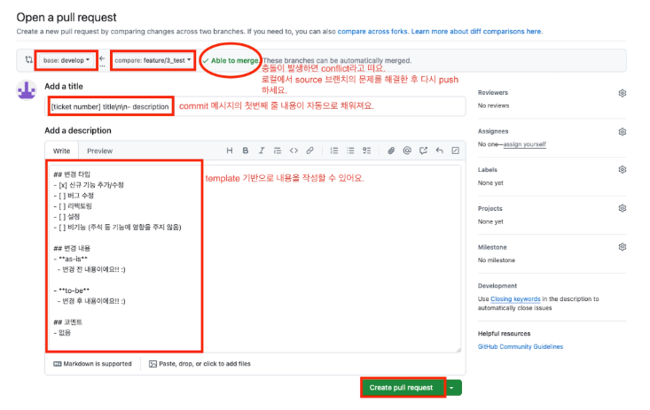

# TIL — {{2026-02-20}}

## 📌 Today Summary
- 오늘 배운 것 한 줄 요약 : 형상관리 (Git & PR(PullRequest))
- 핵심 키워드:
  - 
    - Git vs Github
    - 브랜치 전략 (표준사용: Git-Flow)

---

## 🎯 Today’s Focus
- 오늘의 학습 주제: 버전 관리
- 왜 이걸 공부했는가: 협업
- 기대했던 것: 브랜치 전략, 협업 시 충돌해결 전략

---

## 📘 What I Learned
### 핵심 개념
- HEAD : 현재 내가 작업 중인 위치를 가리키는 포인터. commit/reset/checkout 같은 git 명령은 HEAD를 기준으로 동작. 충돌 해결에 중요한 역할을 함.
- Git 명령어
  - git init
  - git clone
  - git status
  - git add
  - git commit
  - git log : 커밋 히스토리 조회
  - git reflog : HEAD 히스토리 조회
  - git branch
  - git checkout
  - git merge : 브랜치 병합
  - git pull
  - git push
  - **git fetch** : 원격 레파지토리의 변경 내용 확인
- Git-Flow 브랜치 종류
  - master(or main)
  - hotfix: 운영 긴급오류 수정
  - release: 배포 준비 & 배포 전 테스트 및 버그 수정
  - develop: 새로운 기능 모여 통합되는 개발 중심
  - feature: 기능 단위 (가장 최소 단위로)

### 중요한 포인트
- 브랜치명과 커밋 메세지의 좋은 예
  - feature
    - feature/티켓번호_add-validation
    - feature/티켓번호
    - feat/기능-이름
  - release
    - release/1.0.0
    - release-1.0.0
  - hotfix
      - hotfix/버전번호_validation 
      - hotfix-버전번호_validation
      - fix/기능-이름
  - develop
    - dev
    - develop
  - master
    - main
    - master

### 인상 깊은 문장 / 내용
> merge 와 rebase 의 차이
> - 공통적으로 두 기능 모두 브랜치를 병합함.
> - 참고: https://www.atlassian.com/ko/git/tutorials/merging-vs-rebasing
> 
> 
> ## GitHub PR Template 사용하여 PR 하기
> - Template 을 사용하면 구성원 간에 공통 또는 필수로 입력해야하는 항목을 기록할 수 있게 도와줌.
> - 프로젝트 하위에 .github 이라는 숨김 폴더를 만들고 아래 내용을 포함한 pull_request_template.md 파일을 생성.
> - 이 파일을 먼저 target 브랜치에 반영해두면 이후 source → target 으로 PR 시 적용됨.
> ## 변경 타입
> - [ ] 신규 기능 추가/수정
> - [ ] 버그 수정
> - [ ] 리팩토링
> - [ ] 설정
> - [ ] 비기능 (주석 등 기능에 영향을 주지 않음)
> 
> ## 변경 내용
> - **as-is**
>   - (변경 전 설명을 여기에 작성)
> 
> - **to-be**
>   - (변경 후 설명을 여기에 작성)
> 
> ## 코멘트
> - (추가적인 설명이나 코멘트가 필요한 경우 여기에 작성)
> 
> ## 예시  
> 

> ## PR Merge 시 옵션에 대한 설명
> PR을 생성하고 병합(merge)할 때는 GitHub에서 제공하는 세 가지 옵션을 선택할 수 있다.
각 옵션은 프로젝트의 커밋 기록과 협업 방식에 따라 장단점이 있기 때문에 상황에 맞게 고르는 것이 중요!
> - **Create a merge commit**
>    - 머지 커밋을 추가해서 병합.
>    - 머지 되었다는 기록이 남기 때문에 브랜치 흐름(히스토리) 추적 용이.
>    - 단점: 히스토리 지저분해질 수 있다.
> - **Squash and merge**
>    - 모든 커밋을 1개로 합쳐 병합.
>    - 병합 대상 브랜치의 히스토리를 깔끔하게 유지하기 위해 사용.
>    - 단점: 합쳐진 브랜치의 작업의 중간 내역이 사라지기 때문에 주의해야함.
> - **Rebase and merge**
>    - 병합할 브랜치의 커밋들을 그대로 병합 대상 브랜치 위에 추가.
>    - 히스토리를 깔끔하게 유지하고 기존 브랜치의 커밋을 보존할 수 있다.
>    - 단점: 브랜치 분기/병합된 흔적은 사라짐.

---

## 🧠 Insight
- 새롭게 이해한 점 : git fetch, git merge VS rebase
- 관점이 바뀐 부분 : -
- 이전에 알던 것과의 차이 : - 

---

## 🛠 How I Can Use This
- 실생활 / 업무 / 공부에 어떻게 적용할 수 있는가 : 협업
- 바로 써먹을 수 있는 방법 : 협업 시 적용할 브랜치 전략